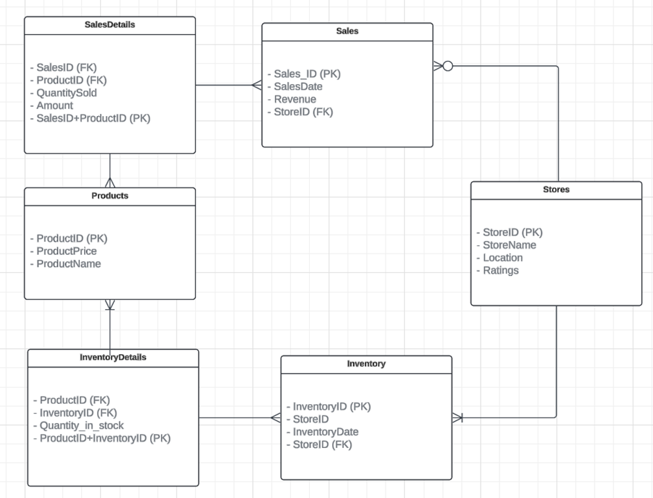

# Top_Home_Retail_insights
 
# Data Analysis and Machine Learning Project

## Project Overview
This repository contains Jupyter notebooks and datasets for a comprehensive data analysis and machine learning project. The analysis focuses on customer segmentation, data collection and integration, data storage, and machine learning models for forecasting.

## Notebooks
- `Q1.ipynb`: Customer Segmentation analysis.
- `Q2.ipynb`: Data collection and integration.
- `Q3.sql` : Data Storage and management 
- `Onki_Q4_XGBoost.ipynb`: Forecasting using XGBoost.
- `Onki_Q4_Random_Forest.ipynb`: Forecasting using Random Forest.


## Data Storage and Management (Question 3)
The data storage solution is designed for efficient data management and retrieval. The system uses relational database management principles, and the structure is outlined in the provided Entity Relationship Diagram (ERD). 

- **Tables**:
  - `Products`: Contains product details.
  - `Stores`: Store information.
  - `Sales`: Sales transactions.
  - `Inventory`: Store inventory records.
  - `SalesDetails`: Details of sales transactions.
  - `InventoryDetails`: Details of inventory records.

### Entity Relationship Diagram (ERD)
Below is the ERD for the database schema used in this project:


## Setup
To run these notebooks, ensure that you have Jupyter installed and the following Python packages:
- numpy
- pandas
- scikit-learn
- xgboost
- matplotlib
- seaborn

Install dependencies using:
```bash
pip install -r requirements.txt
